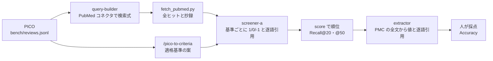

# PubMed SLR screening — TrialMind を Claude Code で組み直す

> **English summary.** A re-implementation of the search, screening and study-characteristics extraction of TrialMind (Wang et al., *npj Digital Medicine* 2025; arXiv:2406.17755) as a Claude Code workflow built from subagents, skills, hooks and MCP.
> It is not an app with a UI: Claude Code runs the workflow and writes a static HTML report. It is for teaching and method validation only, not a substitute for real systematic-review work.
> Results on 3 hematologic-cancer reviews from TrialReviewBench are in [`docs/eval/eval-3.md`](docs/eval/eval-3.md).

**画面の見本（clone しなくても見られる）**：https://herzleben.github.io/pubmed-slr-screening/ — eval-3（原著との比較）と eval-2（人が入る流れ）のレポート。抄録の本文と逐語引用は伏せている

## 1. これは何か

系統的文献レビュー（SLR）を支援する研究 **TrialMind**（Wang et al., npj Digital Medicine 2025、[arXiv:2406.17755](https://arxiv.org/abs/2406.17755)）のうち、**検索・スクリーニング・研究特性の抽出**の3つを、Claude Code の subagent・skill・hook・MCP で組み直したもの。

**画面のあるアプリではなく、Claude Code が回すワークフロー**。人は指示を出し、承認点で結果を見て決める。成果物は静的な HTML のレポート（サーバー不要）。

## 2. 位置づけ

**教育と手法の検証用。業務の一次スクリーニングや抽出の代わりには使わない。**

- 検索は PubMed だけ。業務の SLR に必要な網羅性（Embase・CENTRAL など）には足りない
- 評価は TrialReviewBench の血液がんのレビュー3本だけ（原著は100本）

## 3. 結果（eval-3：人の判断を挟まない、原著と同じ流れ）

| 指標 | 原著（TrialMind、Immunotherapy） | こちら（31190844／33746596／37168849） |
|---|---|---|
| 検索 Recall | 0.711〜0.834 | 1.000／1.000／0.909（計 26/27） |
| Recall@20 | 0.567 | 0.143／0.667／0.636（平均 0.482） |
| Recall@50 | 0.713 | 0.429／1.000／0.909（平均 0.779） |
| 抽出の Accuracy | 0.78（95% CI 0.75–0.81） | 0.735（95% CI 0.642–0.811、102項目） |

原著と同じ条件ではない（レビューの数、候補の母集団、モデル、抽出の入力と採点者の数が違う。原著の値は arXiv 版）。詳しくは [`docs/eval/eval-3.md`](docs/eval/eval-3.md)。人の判断を入れた流れの結果は [`docs/eval/eval-2.md`](docs/eval/eval-2.md)。

## 4. 流れ



- subagent は `.claude/agents/`、規則の skill は `.claude/skills/`、hook は `.claude/hooks/`（出力の形と逐語引用の検査、読めるファイルの制限、同時起動の上限）
- 原著の3つの作業との対応は [`docs/design.md`](docs/design.md) の冒頭の表

## 5. 動かし方

### 必要なもの

- [Claude Code](https://code.claude.com/)。Pro か Max のサブスクリプションで動かす前提。**`ANTHROPIC_API_KEY` は設定しない**（設定すると API の従量課金になる）
- Python 3 と `.venv`
- 公式の PubMed コネクタ（Claude Code の中で）：`/plugin marketplace add anthropics/life-sciences` → `/plugin install pubmed@life-sciences` → 再起動 → `/mcp` で確認
- NCBI の API key は任意。使うなら環境変数 `NCBI_API_KEY`・`NCBI_EMAIL`（`.env` に書いてもよい。`.env` は commit しない）

```sh
python3 -m venv .venv
.venv/bin/pip install -r requirements.txt -r requirements-dev.txt
.venv/bin/python -m pytest -q
.venv/bin/ruff check .
```

テストはネットワークを使わない。

### データの取り方

ベンチマーク [TrialReviewBench](https://huggingface.co/datasets/zifeng-ai/TrialReviewBench)（Apache-2.0。このリポジトリで使ったのは revision `6dfc322`）を `bench/raw/` に置く。`bench/raw/` は commit しない。

```sh
mkdir -p bench/raw/TrialReviewBench-data-extraction
curl -L -o bench/raw/TrialReviewBench-study-search-screening.jsonl https://huggingface.co/datasets/zifeng-ai/TrialReviewBench/resolve/main/TrialReviewBench-study-search-screening.jsonl
curl -L -o bench/raw/TrialReviewBench-data-extraction/33746596.csv https://huggingface.co/datasets/zifeng-ai/TrialReviewBench/resolve/main/TrialReviewBench-data-extraction/33746596.csv
curl -L -o bench/raw/TrialReviewBench-data-extraction/37168849.csv https://huggingface.co/datasets/zifeng-ai/TrialReviewBench/resolve/main/TrialReviewBench-data-extraction/37168849.csv
.venv/bin/python scripts/build_bench.py 33746596 31190844 37168849
.venv/bin/python scripts/build_extraction.py 33746596 37168849
```

整形済みの `bench/reviews.jsonl` と `bench/extraction/*.jsonl` はリポジトリに入っている（上の2行はそれを作り直す）。

### 手順

[`CLAUDE.md`](CLAUDE.md) の「データの流れ」の順に、Claude Code に指示して進める。抄録・全文・判定の結果は `results/` に書かれる（commit しない）。

- eval-3 のレポート：`.venv/bin/python scripts/build_report.py --run eval-3` → `results/eval-3/report.html`
- 評価の `/eval` は人が打つ（Claude Code が自分で起動しない）
- 公開用の見本（抄録と引用を伏せ、読むだけ）：`.venv/bin/python scripts/build_report.py --public --out docs/demo/eval-2.html` と `.venv/bin/python scripts/build_report.py --run eval-3 --public --out docs/demo/eval-3.html`

## 6. データとライセンス

- コード：MIT（[`LICENSE`](LICENSE)）
- `bench/` の整形済みファイルは TrialReviewBench（Apache-2.0）から作った（[`NOTICE`](NOTICE)）
- 答えの CSV、抄録、全文はリポジトリに入れていない（スクリプトで取る）
- `docs/samples/` には、判定の根拠として抄録から引いた短い逐語引用（基準ごとに1文程度）がある
- `docs/demo/`（画面の見本）は、抄録の本文と逐語引用を伏せてある。抽出した値（短い文字列）は残している

## 7. リポジトリの読み方

1. [`CLAUDE.md`](CLAUDE.md)：Claude Code が守るルール、データの流れ、hook
2. [`docs/requirements.md`](docs/requirements.md)：人が決めた要件と理由
3. [`docs/design.md`](docs/design.md)：どう作るか
4. [`docs/DECISIONS.md`](docs/DECISIONS.md)・[`docs/HARNESS.md`](docs/HARNESS.md)：途中で決めたこと、想定と違ったこと
5. [`docs/prompts/log.md`](docs/prompts/log.md)：人が出した指示の記録（hook が記録。個人の情報とローカルのパスは消してある）

節目の状態は `snap/*` の tag で辿れる：`snap/02-benchmark`、`snap/03-criteria-draft`（人が直す前）、`snap/04-criteria-approved`、`snap/05-query-approved`、`snap/06-no-subagent`、`snap/07-agents-v1`、`snap/08-first-parallel`、`snap/09-hook`、`snap/10-eval-1`、`snap/11-eval-2`、`snap/12-eval-2-notes`、`snap/13-prisma-eval`、`snap/14-positioning`、`snap/15-extraction-items`、`snap/16-eval-3-screened`、`snap/17-eval-3`、`snap/18-extraction`、`snap/19-extraction-eval`、`snap/20-public`

## 8. 記事

連載：`<連載の URL>`
